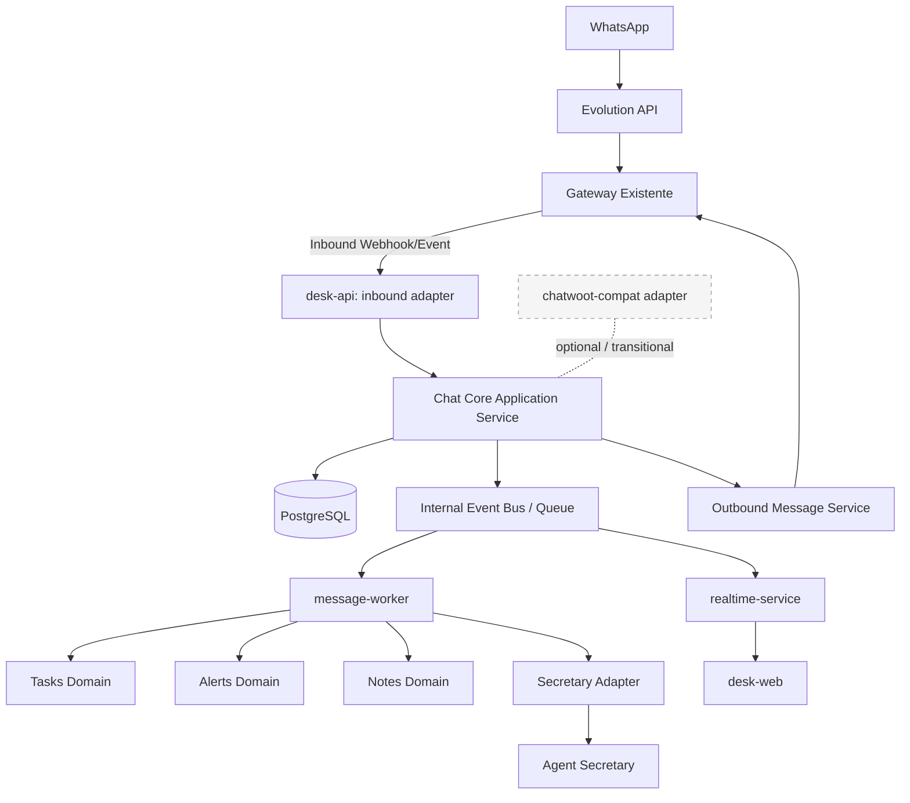

# Arquitetura Alvo — CVG Connect Desk

## 1. Objetivo Arquitetural
A arquitetura alvo do **CVG Connect Desk** deve permitir:
- evolução incremental sem quebrar a operação existente;
- separação clara entre integração, domínio, processamento assíncrono e realtime;
- preservação do Gateway e da Agent Secretary;
- centralização do estado operacional no Connect Desk;
- compatibilidade legada isolada em adapters.

Nesta fase, a arquitetura adota:
- modularidade por domínio;
- ports and adapters;
- event-driven interno;
- processamento síncrono e assíncrono com fronteiras explícitas.

## 2. Princípio Central
O **Connect Desk** é a fonte da verdade do estado operacional de:
- conversas;
- mensagens persistidas internamente;
- atribuições;
- status;
- tags;
- tarefas;
- notas;
- alertas.

O sistema **não** é fonte da verdade para:
- canal WhatsApp;
- conexão com o canal;
- inteligência da IA;
- infraestrutura do Gateway.

Esses componentes permanecem externos e preservados.

## 3. Estado Atual do Repositório e Leitura Correta desta Arquitetura

> **Última revisão:** 2026-04-09 — Estado revalidado

**Estado atual do repositório:**
- `apps/desk-api` — API Fastify operacional com módulos registrados
- `apps/desk-web` — Frontend React/Vite operacional com realtime conectado
- `apps/message-worker` — Worker implementado e funcional
- `apps/realtime-service` — WebSocket server implementado e conectado ao frontend
- `packages/events` e `packages/realtime` — pacotes de apoio funcionais
- Módulos em `modules/` para `chat`, `tasks`, `notes`, `alerts`, `admin`, `audit`, `dashboard`, `secretary-adapter`, `labels`, `sectors`, `transfers`, `contacts`, `kanban`, `gateway-adapter`

**Este documento descreve:**
1. A **arquitetura alvo** — direção que o sistema deve seguir
2. Os **componentes já implementados** — estado atual funcional
3. Os **gaps técnicos conhecidos** — áreas que ainda precisam evoluir

**Gaps técnicos conhecidos (não impedem operação, mas limitam escala):**
- Pipeline de eventos utiliza `InMemoryEventPublisher` — não é ainda interprocesso real em topologia distribuída
- Autenticação do realtime é baseada em userId enviado pelo cliente — não valida sessão no banco
- Webhook: HMAC opcional quando `WEBHOOK_SECRET` não configurado

Para verificar o estado de implementação dos runtimes, consultar `docs/18-deployment-and-runtime.md`.

## 4. Fluxo Arquitetural Alvo

## 5. Camadas e Responsabilidades

### 5.1 Channel Edge (Externo)
Componentes:
- WhatsApp;
- Evolution API;
- Gateway existente.

Responsabilidades:
- conectividade com o canal;
- envio e recebimento físico de mensagens;
- transporte externo.

Regras:
- não alterar nesta fase;
- não duplicar a integração de canal dentro do Connect Desk;
- o Connect Desk não deve falar diretamente com a Evolution API se o Gateway já é a borda oficial.

### 5.2 Inbound / Outbound Adapter Layer
Componentes:
- inbound adapter no `desk-api`;
- outbound message service;
- `secretary-adapter`;
- `chatwoot-compat` quando estritamente necessário.

Responsabilidades:
- receber eventos do Gateway;
- validar e normalizar payload;
- traduzir contratos externos para o modelo interno;
- enviar mensagens para o Gateway;
- concentrar compatibilidade legada.

Regras:
- payload externo nunca deve vazar cru para o core;
- todo processamento inbound deve ser idempotente, com deduplicação baseada em identificador externo de evento ou mensagem sempre que esse identificador estiver disponível;
- toda solicitação outbound deve ser rastreável internamente, preservando o vínculo entre intenção de envio, tentativa executada e resultado observado;
- toda compatibilidade com legado deve ficar nessa camada;
- nenhum domínio interno deve depender diretamente de formato legado;
- integração com a Secretary deve passar por um único adapter dedicado.

### 5.3 Application / Domain Core
Componentes:
- chat;
- tasks;
- notes;
- alerts;
- admin;
- audit;
- dashboard.

Responsabilidades:
- executar regras de negócio;
- persistir estado operacional;
- publicar eventos internos;
- aplicar políticas de domínio.

Regras:
- o core é dono do estado operacional;
- o core não conhece detalhes de Evolution API, Gateway ou Chatwoot;
- integrações externas entram apenas por adapters;
- dashboard e audit são capacidades de leitura e rastreabilidade sobre o estado do core, não centros independentes de domínio.

### 5.4 Asynchronous Processing
Componentes:
- fila interna;
- `message-worker` como papel arquitetural de consumo assíncrono.

Responsabilidades:
- processar efeitos secundários de eventos;
- disparar atualizações para tasks, alerts e integrações auxiliares;
- desacoplar processamento pesado do fluxo síncrono;
- acionar a Secretary de forma controlada quando o fluxo exigir.

Regras:
- controller ou webhook não deve conter regra de negócio pesada;
- worker não deve ser fonte primária de verdade do estado;
- efeitos assíncronos devem ser idempotentes;
- chamadas assíncronas externas devem partir de eventos já persistidos.

### 5.5 Realtime Projection
Componentes:
- `realtime-service` como papel arquitetural de projeção em tempo real;
- `packages/realtime` como base de suporte no monorepo;
- `desk-web` como consumidor autenticado.

Responsabilidades:
- transformar eventos internos em atualização para frontend;
- atualizar inbox, detalhe da conversa, tarefas e alertas em tempo real.

Regras:
- realtime não decide regra de negócio;
- realtime não persiste como fonte primária;
- realtime consome eventos do sistema já persistidos.

## 6. Componentes de Runtime Esperados
Os itens abaixo representam componentes operacionais esperados pela arquitetura alvo. Eles não precisam necessariamente existir como serviços separados já no estado atual do código, mas suas responsabilidades devem permanecer claras e isoladas.

### 6.1 `apps/desk-api`
Responsável por:
- autenticação;
- rotas administrativas;
- rotas operacionais;
- inbound adapter;
- orquestração síncrona inicial;
- publicação de eventos internos.

### 6.2 `message-worker`
Responsável por:
- consumo de filas e eventos internos;
- tarefas derivadas;
- alertas derivados;
- integrações assíncronas;
- acionamento controlado da Secretary quando aplicável.

**Estado atual (2026-04-09):** Implementado em `apps/message-worker/src/index.ts`. Funciona como processo separado consumindo do `InMemoryEventPublisher`.

### 6.3 `realtime-service`
Responsável por:
- notificação em tempo real para a interface web;
- projeção de eventos internos para consumidores autenticados.

**Estado atual (2026-04-09):** Implementado em `apps/realtime-service/src/index.ts` (porta 8080). Conectado ao frontend via WebSocket em `apps/desk-web/src/lib/realtime.ts`.

### 6.4 `desk-web`
Responsável por:
- inbox operacional;
- detalhe da conversa;
- painel lateral;
- tarefas;
- alertas;
- dashboard;
- administração.

## 7. Regras de Fronteira

### 7.1 Gateway
- é a borda oficial de mensagens;
- não deve ser duplicado;
- não deve ser contornado por integração paralela.

### 7.2 Secretary
- é serviço externo e orquestrado;
- não é dona do estado da conversa;
- não deve ser chamada diretamente por múltiplos módulos;
- a integração deve passar pelo `secretary-adapter`.

### 7.3 Chatwoot Compatibility
- é módulo opcional e transitório;
- serve apenas para compatibilidade legada;
- não pode receber regra nova de domínio;
- não pode ser centro do sistema.

## 8. Eventos Internos em Nível Arquitetural
O sistema deve operar com eventos internos como:
- `conversation.created`;
- `message.inbound.received`;
- `message.outbound.requested`;
- `message.persisted`;
- `conversation.assigned`;
- `conversation.status.changed`;
- `task.created`;
- `alert.created`;
- `handoff.requested`;
- `handoff.completed`.

A definição detalhada de envelope, versionamento, retry e lifecycle pertence ao documento de realtime e eventos.

## 9. Decisões Arquiteturais Preservadas
São decisões fixas nesta fase:
- Gateway não será alterado;
- Evolution API não será integrada diretamente ao core;
- Agent Secretary não será reescrita;
- compatibilidade legada ficará isolada;
- estado operacional ficará centralizado no Connect Desk;
- lógica de domínio não ficará em adapters, worker de projeção ou realtime.

## 10. Regras de Implementação
Antes de implementar qualquer fluxo ou endpoint, é obrigatório:
- verificar se já existe rota equivalente;
- verificar se já existe adapter para a integração;
- verificar se a responsabilidade pertence ao core, ao processamento assíncrono ou ao realtime;
- impedir criação de rota solta;
- impedir duplicação de integração;
- impedir regra de negócio em camada errada.

Se houver divergência entre implementação e este documento:
- a arquitetura deve ser corrigida; ou
- o documento deve ser atualizado explicitamente antes de prosseguir.

## 11. Regra de Precedência
Este documento define a arquitetura alvo e tem precedência sobre:
- roadmap;
- implementation phases;
- decisões abertas de execução.

Arquitetura não pode ser alterada implicitamente por conveniência de implementação. Se houver conflito, a divergência deve ser resolvida de forma explícita na documentação antes de avançar.
