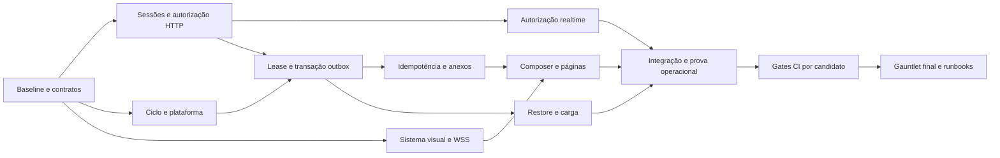

**Roadmap executivo — marcos governados por evidência**

As fases abaixo agrupam resultados, não impõem serialização de todo o trabalho. O DAG em BACKLOG.json é a ordem de dependências. Lotes são sugestões: só iniciar sucessor após implementação, crítica, integração e evidência dos predecessores. Paralelismo respeita ownership; mudança no contrato exige recalcular.

| Marco | Foco / tarefas | Demonstração de saída |
|---|---|---|
| M0 — Baseline e contratos | AAA-00/01 | Candidato e ambiente isolado identificados; harness tem caso negativo; contratos executáveis e decisões condicionantes registradas |
| M1 — Acesso e fronteiras | AAA-02/03/04/05/06/09/15/19 | Sessão expirada não renova; setores não vazam HTTP/WS; DAG sem ciclo; WSS remoto e readiness503; autoria verdadeira e triagem de deps |
| M2 — Integridade e plataforma | AAA-07/08/10/11/12/14/16/18/20 | Crash/concorrência recuperados sem perda; anexos no limite e scanner; consultas limitadas; build/lint/typecheck reais; shell/tokens preservados |
| M3 — Experiência completa | AAA-13/17/21/29/30/31 | Operador envia, recupera erros e mantém rascunho/contexto; páginas/estados reais e política de dados aplicada conforme decisão |
| M4 — Prova operacional | AAA-22/23/24/25 | Browser/teclado/leitor de tela; integração com serviços reais; restore cronometrado; benchmark/traces/alertas; visual revisado |
| M5 — Candidato integrado | AAA-26/27/28 | CI por SHA e imagem, runbooks reconciliados, Gauntlet final fresco e todos gates atuais aprovados |

**Caminho crítico lógico.** Pelo peso relativo dos cartões, sem restrição de recursos:

AAA-00 → AAA-01 → AAA-02 → AAA-07 → AAA-08 → AAA-12 → AAA-13 → AAA-21 → AAA-29 → AAA-23 → AAA-26 → AAA-27 → AAA-28.

Soma: **74 pontos** no caminho; **179 pontos** no catálogo. Pontos não são duração. Restrições de arquivos, revisão, ambiente e decisões podem dominar o caminho real. Não derivar uma data somando pontos como horas. Reestimar após o primeiro lote integrado.

O diagrama resume dependências de resultados; não substitui todas as arestas do JSON. Nenhuma etapa de deploy está autorizada por esse diagrama.

**Lotes sugeridos para dois builders, snapshot gerado do DAG**

| Lote | Tarefas | Observação |
|---|---|---|
| 1 | AAA-00 | Uma fronteira pronta estruturalmente; confirmar evidência |
| 2 | AAA-01 | Uma fronteira pronta estruturalmente; confirmar evidência |
| 3 | AAA-02, AAA-03 | Ownership disjunto; predecessores precisam de evidência |
| 4 | AAA-04, AAA-06 | Ownership disjunto; predecessores precisam de evidência |
| 5 | AAA-05, AAA-11 | Ownership disjunto; predecessores precisam de evidência |
| 6 | AAA-07, AAA-19 | Ownership disjunto; predecessores precisam de evidência |
| 7 | AAA-08, AAA-20 | Ownership disjunto; predecessores precisam de evidência |
| 8 | AAA-09, AAA-12 | Ownership disjunto; predecessores precisam de evidência |
| 9 | AAA-10 | Uma fronteira pronta estruturalmente; confirmar evidência |
| 10 | AAA-13, AAA-17 | Ownership disjunto; predecessores precisam de evidência |
| 11 | AAA-15 | Exclusividade de escrita no repositório |
| 12 | AAA-14 | Exclusividade de escrita no repositório |
| 13 | AAA-16 | Exclusividade de escrita no repositório |
| 14 | AAA-18, AAA-21 | Ownership disjunto; predecessores precisam de evidência |
| 15 | AAA-24, AAA-29 | Ownership disjunto; predecessores precisam de evidência |
| 16 | AAA-30, AAA-31 | Ownership disjunto; predecessores precisam de evidência |
| 17 | AAA-22 | Uma fronteira pronta estruturalmente; confirmar evidência |
| 18 | AAA-23 | Uma fronteira pronta estruturalmente; confirmar evidência |
| 19 | AAA-25 | Uma fronteira pronta estruturalmente; confirmar evidência |
| 20 | AAA-26 | Uma fronteira pronta estruturalmente; confirmar evidência |
| 21 | AAA-27 | Uma fronteira pronta estruturalmente; confirmar evidência |
| 22 | AAA-28 | Uma fronteira pronta estruturalmente; confirmar evidência |

Regerar com `python3 docs/execucao-aaa-2026-09-12/plan.py waves --slots 2`. Um lote não é um sprint nem processo em andamento; sua presença não reserva recursos. O snapshot atual está em [lotes-planejados.json](evidencias/lotes-planejados.json).

**Checkpoints e saída de fase.** No início: revisão/hash e contratos; durante: hipótese, implementação e resultados; ao sair: crítico fresco, reteste e integração. Se houver High/Critical, manter marco aberto e gerar retrabalho no responsável. NÃO mover toda a fila para DONE por nota média, ausência de erro no log ou número de rodadas.

**Recuperação e sequência inicial.** AAA-00 precede qualquer suíte mutante de banco. AAA-01 produz contratos sem precisar executar toda a aplicação; D02 pode bloquear só AAA-17. AAA-02 e AAA-03 formam o primeiro lote de implementação paralelo. Atualizações amplas AAA-15/14/16 são exclusivas de escrita, com revisão na vaga reservada. Páginas AAA-29/30/31 podem compartilhar janela após AAA-21, desde que arquivos globais continuem com dono único. O último cartão AAA-28 depende inclusive dos IDs 29–31: ordem numérica não é ordem de execução.
