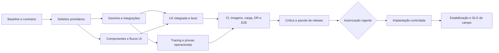

# Roadmap orientado a entregas verificáveis

O roadmap usa marcos, não datas inventadas. Estimativa total: **411 pontos relativos**; após a auditoria R3, as 63 tarefas estão não DONE: 19 em REWORK e 44 PLANNED. Dezessete implementações permanecem no worktree, mas exigem requalificação. O detalhamento vigente está no [roadmap R3](rodadas/R3/ROADMAP-R3.md).

| Marco | Tarefas / pontos | Estado R3 | Resultado demonstrável |
|---|---:|---|---|
| M0 — baseline e contratos | 3 /16 | REWORK 3 | Reparar selo, revalidar contratos e provar isolamento sem teardown genérico. |
| M1 — defeitos prioritários | 7 /32 | REWORK 7 | Requalificar correções preservadas no mesmo candidato, por aceite e com I1 final. |
| M2 — domínio e integrações | 22 /144 | REWORK 9; PLANNED 13 | Fechar crashes, fault injection, rollback lossless, alertas/worker, KPIs e integrações. |
| M3 — operação humana e fundamentos | 20 /130 | PLANNED 20 | As 16 telas, sincronização, matriz UX, boot, tracing e qualidade de código. |
| M4 — prova do candidato | 7 /63 | PLANNED 7 | CI/coverage, imagens, carga, DR durável, E2E e runbooks no mesmo candidato. |
| M5 — qualificação e pacote | 2 /13 | PLANNED 2 | Crítica independente de 59 critérios e pacote go/no-go. |
| M6 — implantação autorizada | 1 /5 | PLANNED 1 | Promoção controlada somente com autoridade D06. |
| M7 — estabilização | 1 /8 | PLANNED 1 | Operação sustentada e primeira janela SLO observada. |

M3 inclui SA-052/053/063: boot, tracing e disciplina de código começam antes dos gates finais. IDs expressam identidade, não ordem numérica. As dependências do [BACKLOG.json](BACKLOG.json) são a ordem executável; marcos são agrupamentos de resultado, não barreiras que impedem iniciar trabalho independente.

## Primeiras entregas em ordem segura

1. SA-001 corrige o ponto cego de `.env.production.example`, separa identidade do produto e integridade do livro-caixa e valida controles conhecidos.
2. SA-002/003/004 requalificam contratos, isolamento e DTO/logs no candidato aceito.
3. SA-005–010 requalificam M1 em lotes pequenos, com prova pública e I1 depois da última mudança.
4. SA-014/020/015/019/012 fecham falhas diretas de aceite antes de ampliar o domínio.
5. SA-016/017/018/021/022 avançam após as dependências, seguindo o backlog R3.

## Caminho crítico e riscos de prazo

O utilitário `programa.py validate` calcula o maior caminho de dependências ponderado por pontos. É uma aproximação para priorização, **não calendário**, pois decisões, ambiente e recursos compartilhados podem dominá-lo. O caminho inicial passa por autorização operacional, alertas/worker/IA, admin UI, sincronização, CI/imagens, E2E, documentação e revisão.

Principais travas externas: D03 para relaçãoN:N; D01 para políticas de acesso; D02 para política de dados; D05 para habilitaçãoIA; ambientes oficiais para provedores; D06 para implantação. Antecipar propostas/contratos e trabalho sintético, sem bloquear a fila inteira por uma decisão parcial.

## Capacidade e paralelismo

Envelope padrão do agente: **até 4 agentes ativos no total**, inclusive lead. Normal: lead +2 builders +1crítico. Durante descoberta, três especialistas podem atuar e devolver vagas para a crítica. Não criar descendentes sem replanejar capacidade.

- Backend/dados reserva schema, migração e contratos de persistência com dono único.
- Frontend reserva páginas/primitivas/tokens; não executar dois escritores de Inbox/Admin simultaneamente.
- Operação reserva Compose, Docker, CI, lockfile e cada ambiente de teste.
- QA/críticos leem o artefato integrado; artefatos de testes têm diretórios exclusivos.

Arquivos compartilhados exigem serialização ou worktrees isolados mais integração explícita. “Frentes diferentes” não elimina conflito de arquivo, banco, porta, fila ou dataset. BacklogREADY exige dependências satisfeitas, contrato atual, autoridade pertinente e reserva concretizada.

## Replanejamento

Após cada marco: atualizar esforço observado, estado dos riscos, decisões, notas provisórias e evidências. Nota provisória não fecha gate. Reabrir tarefas afetadas por drift, regressão ou mudança de contrato. Preservar a barra e o histórico de falhas. Nenhum marco termina apenas porque seus arquivos foram criados.
