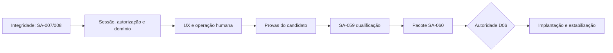

# Roadmap da rodada R2 — histórico

**Supersedido em 15/09/2026 pela [R3](../R3/ROADMAP-R3.md). Não usar como fila de execução atual.**

O roadmap usa gates e dependências, sem datas inventadas. A barra de qualidade permanece QB-1.

| Onda | Escopo | Pontos | Saída verificável |
|---|---|---:|---|
| R2.0 — recuperar integridade | SA-007, SA-008 e fechamento probatório de SA-004 | 10 no backlog + revisão | Typecheck verde; contexto comprovado em browser+API; candidato de checkpoint selado; estados e revisões coerentes. |
| R2.1 — domínio e segurança | SA-011–SA-032 | 144 | Sessão, autorização, mensagens, tarefas, notas, alertas, transferências, relações, KPIs, migrações, workers, integrações, privacidade e mídia aceitos nas fronteiras reais. |
| R2.2 — experiência integrada | SA-033–SA-049, SA-052, SA-053 e SA-063 | 130 | As 16 superfícies, estados, realtime, boot, tracing, tipos e lint funcionam e são observados. |
| R2.3 — prova do candidato | SA-050, SA-051, SA-054–SA-058 | 63 | Coverage, supply chain, dashboards, DR durável, carga, Web Vitals, documentação e E2E no mesmo candidato. |
| R2.4 — qualificação | SA-059 e SA-060 | 13 | Crítica independente, 59 avaliações ≥95, G01–G12 aprovados e pacote go/no-go revisável. |
| R2.5 — operação autorizada | SA-061 e SA-062 | 13 | Implantação somente com autoridade; depois estabilização e janela de SLO observada. |

## Sequência inicial

1. SA-007: corrigir a falha de tipos, repetir integração e revisão.
2. SA-008: executar browser+API real com duas conversas, back, refresh, deep-link e negativos.
3. Em paralelo independente, SA-012 e SA-020.
4. Após SA-007: SA-011 e SA-014. Após SA-012: SA-013.
5. Após SA-013 e SA-008: SA-015, SA-016, SA-019, SA-021 e SA-031.
6. Concluir SA-017 e SA-018; então fechar SA-022 com todas as fórmulas e planos de consulta.
7. Seguir as dependências do backlog para os demais marcos. Selar um candidato novo antes dos gates integrados.

