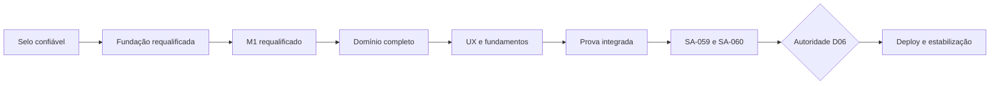

# Roadmap da rodada R3

O roadmap usa gates e dependências, sem datas inventadas. A barra QB-1 permanece congelada.

| Onda | Escopo canônico | Pontos afetados | Saída verificável |
|---|---|---:|---|
| R3.0 — restaurar identidade | SA-001 | 3 | Selos separados de produto e controle; toda configuração versionada coberta; controles conhecidos ruim/bom; candidato reproduzível e crítica I1 válida. |
| R3.1 — requalificar fundação | SA-002, SA-003, SA-004 | 16 | Contratos/denominadores vinculados; isolamento sem teardown genérico; DTO/logs negativos atuais. |
| R3.2 — requalificar M1 | SA-005–SA-010 | 29 | Atomicidade, conversa, contexto browser, realtime e DR local novamente provados no mesmo candidato. |
| R3.3 — fechar aceites críticos de domínio | SA-011–SA-015, SA-019, SA-020 | 45 | Rotas atuais; sessão completa; authz; crash/SIGKILL; fault injection; catálogos completos; rollback lossless ou decisão formal. |
| R3.4 — completar M2 | SA-016–SA-018, SA-021–SA-032 | 99 | Notas, alertas com worker real, transferências, KPIs, outbox, integrações, privacidade e mídia aceitos. |
| R3.5 — experiência e fundamentos | SA-033–SA-049, SA-052, SA-053, SA-063 | 130 | 16 superfícies, estados, acessibilidade, realtime, boot, tracing, lint e tipos verificados. |
| R3.6 — prova integrada | SA-050, SA-051, SA-054–SA-058 | 63 | CI sem omissões, coverage, supply chain, carga, DR durável, budgets e E2E no mesmo candidato. |
| R3.7 — qualificação | SA-059, SA-060 | 13 | 59 avaliações ≥95, G01–G12 aprovados, crítica final e pacote go/no-go. |
| R3.8 — operação autorizada | SA-061, SA-062 | 13 | Deploy somente com autoridade; estabilização e SLO observados em campo. |

## Caminho de controle

## Regras de avanço

1. Uma onda pode preparar trabalho independente, mas nenhuma tarefa ignora suas dependências canônicas.
2. Cada tarefa reaberta deve distinguir “implementação preservada” de “aceite ainda não comprovado”.
3. Teste e crítica devem referenciar o mesmo candidato; qualquer mutação material torna o resultado `STALE`.
4. Builder não aprova a própria correção. Findings corrigidos exigem nova passagem I1.
5. SA-050 deve tornar a suíte obrigatória enumerável e impedir omissões silenciosas.
6. SA-059 começa apenas com todas as entregas anteriores `DONE` e zero Critical/High aberto.
